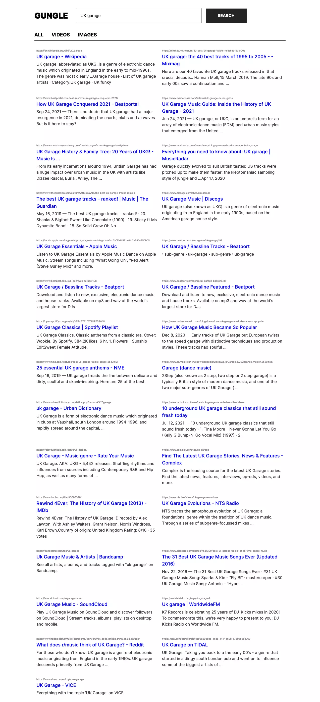

# Goggle Clone
A project using the Google Api from rapid API, data is fetched on click and results are displayed on different routes using React Router. Made use of the fetch Api to make Api requests. 

Styling is done using styled components. 

You can view the project live here: [GUNGLE](gungle-w-sc.netlify.app)

## Demo

or you can run it locally: 

In the project directory, you can run:

### `npm install`
To install all node modules locally

### `npm start`

Runs the app in the development mode.\
Open [http://localhost:3000](http://localhost:3000) to view it in the browser.